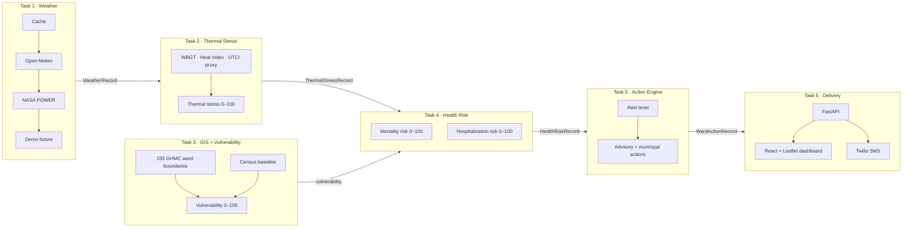

<div align="center">

# 🛡️ RAKSHA
### Extreme Heatwave Early Warning & Human Thermal Stress Index

**Smart India Hackathon · Problem Statement 26083**

*From weather forecast to ward-level action, before the heat becomes a health emergency.*


</div>

---

## 📌 Table of Contents

1. [The Problem](#-the-problem)
2. [Our Solution](#-our-solution)
3. [What Makes RAKSHA Different](#-what-makes-raksha-different)
4. [System Architecture](#-system-architecture)
5. [The Science, Simply Explained](#-the-science-simply-explained)
6. [Dashboard Features](#-dashboard-features)
7. [Quick Start](#-quick-start)
8. [API Reference](#-api-reference)
9. [SMS Alerts (Twilio)](#-sms-alerts-twilio)
10. [Project Structure](#-project-structure)
11. [Testing](#-testing)
12. [Honest Limitations](#-honest-limitations)
13. [Roadmap](#-roadmap)
14. [Tech Stack](#-tech-stack)
15. [Team](#-team)

---

## 🔥 The Problem

Heatwaves are among India's deadliest and most under-managed climate hazards. Today's warnings share three weaknesses:

- **Too coarse.** Alerts are issued for whole districts or cities, but heat risk changes street by street. A dense informal settlement with little tree cover faces very different danger from a leafy neighbourhood a few kilometres away.
- **Temperature-only.** Air temperature alone misses humidity, sunshine and wind, which decide how hot the human body actually *feels* and how quickly it overheats.
- **Not actionable.** A number like "44 °C" doesn't tell a ward officer *what to do*: which cooling centres to open, where to prepare hospitals, whom to notify.

## 💡 Our Solution

**RAKSHA** (*"protection"* in Hindi) is an end-to-end early-warning system that answers three questions for every ward in Hyderabad (155 GHMC wards):

| | Question | How RAKSHA answers |
|---|---|---|
| **1** | *How dangerous is the weather to the human body?* | A **Human Thermal Stress Index** (0–100) built from temperature, humidity, solar radiation and wind |
| **2** | *Who is most at risk, and how badly?* | A **ward vulnerability index** using elderly population, outdoor workers, informal settlements and green cover, combined with the thermal index into a **5-day health-risk forecast** |
| **3** | *What should the city do about it?* | An **action engine** that assigns an alert level (LOW → CRITICAL), advisory text and municipal actions, delivered on a live map and by SMS |

---

## ✨ What Makes RAKSHA Different

- **Hyper-local, not city-wide.** Every score, alert and action is computed per ward and shown on an interactive map.
- **Human-centred physics.** Uses WBGT, Heat Index and a UTCI-style proxy instead of raw temperature. This stage is fully deterministic: no black-box ML, every formula documented.
- **Vulnerability-aware.** Two wards with identical weather get different alerts if one houses more elderly residents and outdoor workers.
- **Never fails silently.** The weather layer falls back from cache → Open-Meteo → NASA POWER → a versioned demo fixture, and every record carries a `quality_flag` so downstream users always know how much to trust it. Missing data is never quietly replaced with an average.
- **From insight to action.** Alerts map directly to municipal actions (open cooling centres, shift outdoor work hours, increase hospital readiness) and to SMS for three stakeholder roles.
- **Clean, contract-driven pipeline.** Each stage hands the next a versioned, typed record (`WeatherRecord` → `ThermalStressRecord` → `HealthRiskRecord` → `WardActionRecord`), so any stage can be upgraded without breaking the rest.
- **Radically honest about data.** Synthetic data is tagged `is_synthetic=true` end to end, alert thresholds are labelled as prototype rules, and the dashboard reports plainly when real SMS is not configured.

---

## 🏗️ System Architecture



| Stage | Folder | Responsibility |
|---|---|---|
| **1 · Weather** | `tasks/task1/26083-task1` | Resilient, normalised weather ingestion with quality flags |
| **2 · Thermal stress** | `tasks/task2/26083-feature-task2-thermal-stress` | Deterministic WBGT / Heat Index / UTCI proxy → 0–100 score and risk band |
| **3 · GIS & vulnerability** | `tasks/task3/26083-feature-task3-gis-demographics` | Ward boundaries (TGRAC official, DataMeet fallback), Census baseline, vulnerability index |
| **4 · Health risk** | `tasks/task4/task4` | Poisson models for mortality and hospitalization, Day +1 to +5, with calibration and drivers |
| **5 · Actions** | `tasks/task5/26083-task5` | Alert level, advisory text, municipal actions, notification status |
| **6 · Delivery** | `task6` | REST API, live dashboard, SMS |

---

## 🔬 The Science, Simply Explained

### 1. Human Thermal Stress Index (Task 2)
The body cools by sweating, and humid air stops sweat from evaporating. So RAKSHA estimates **Wet Bulb Globe Temperature (WBGT)**, the standard measure of occupational heat stress:

```
WBGT ≈ 0.567·T + 0.393·e + 3.94        (e = vapour pressure from T and humidity)
+ up to 2 °C solar correction when radiation > 400 W/m²
```

It is rescaled so **18 °C WBGT → 0** and **40 °C WBGT → 100**, then banded:

| Score | Band |
|---|---|
| 0–40 | Low |
| 40–60 | Moderate |
| 60–80 | High |
| 80–100 | Extreme |

The NWS **Heat Index** (Rothfusz regression) and a wind-adjusted **UTCI-style proxy** are computed alongside for reference.

### 2. Ward Vulnerability Index (Task 3)
```
Vulnerability = 0.35 × outdoor-worker exposure
              + 0.30 × elderly exposure
              + 0.25 × informal-settlement density
              + 0.10 × tree-canopy deficit
```
Each component is normalised to 0–100. Wards also receive tags such as `CRITICAL_COMBINED_HEAT_VULNERABILITY` or `SENIOR_POPULATION_HEAT_RISK`.

### 3. Health Risk (Task 4)
Poisson regression models predict daily mortality and hospitalization risk from thermal stress (mean and max), vulnerability, heat persistence and seasonality. Calibration is computed **once at training time** and saved, so a ward-day always scores the same regardless of what else is in the batch. Each prediction lists its top drivers.

### 4. Action Risk and Alert Levels (Task 5)
```
action_risk = 0.70 × max(mortality, hospitalization)
            + 0.30 × vulnerability
            + 5   (if heat persists ≥ 12 hours)
```

| Alert | Action risk | Example municipal actions | Notify? |
|---|---|---|---|
| 🟢 **LOW** | 0–30 | Monitor conditions, keep cooling facilities ready | No |
| 🟡 **MODERATE** | 31–60 | Prepare cooling centres, raise healthcare readiness, monitor power demand | Yes |
| 🟠 **HIGH** | 61–80 | Open cooling centres, prepare for power demand, consider shifting outdoor work hours | Yes |
| 🔴 **CRITICAL** | 81–100 | Activate cooling centres, strengthen healthcare, shift outdoor work hours | Yes |

Full matrix: `tasks/task5/26083-task5/docs/alerts/action_matrix.md`.

---

## 🖥️ Dashboard Features

> 📸 *Add screenshots here: `docs/screenshots/dashboard.png`, `ward-detail.png`, `sms-alert.png`.*

- **Ward alert map:** all 155 wards colour-coded by alert level on OpenStreetMap. Click any ward to update every panel.
- **Three-stage pipeline view:** *Observe → Assess → Respond*. Expand each stage to inspect the exact values behind a decision.
- **Live weather:** current weather and forecast for the selected ward's location via Open-Meteo.
- **5-day outlook:** weather alongside the health-risk forecast, with a Day 1–5 selector.
- **Alert filtering:** filter the response centre by LOW / MODERATE / HIGH / CRITICAL.
- **Municipal action cards:** advisory text and recommended actions for each ward.
- **One-click notifications:** send to the Municipal/Ward Officer, Disaster Management Control Room, or Health Coordination Officer, simulated or via real SMS.

---

## 🚀 Quick Start

**Requirements:** Python 3.10+ · Node.js 18+ · internet access (map tiles and live weather)

```bash
# 1 · Backend
cd task6/backend
python -m pip install -r requirements.txt
uvicorn app.main:app --reload            # → http://127.0.0.1:8000/docs
```

```bash
# 2 · Dashboard (new terminal)
cd task6/frontend
npm install
npm run dev                              # → open the URL Vite prints
```

The dashboard connects to `http://127.0.0.1:8000/api/v1` by default (override with `VITE_API_BASE`). **No API keys are needed for the demo.**

> **Windows:** `run_backend.bat` / `run_frontend.bat` do the same. They resolve `task6\...` relative to their own location, so place them in the folder that *contains* `task6/`.
> **Layout matters:** the backend imports the Task 5 engine from `../tasks/task5/...`, so keep `task6/` and `tasks/` side by side.

### 🎬 Suggested 5-minute demo

1. Open the map and point out the alert distribution across wards.
2. Click a high-vulnerability ward (e.g. `GHMC_W002`) and walk through Stage 1 → 2 → 3.
3. Show the Day 1–5 outlook and the driver behind the risk.
4. Expand the municipal action card.
5. Send a notification to a stakeholder role.
6. Open `/docs` to show the API is clean and reusable.

---

## 📡 API Reference

Base path: `/api/v1`, with interactive docs at `/docs`.

| Method | Endpoint | Description |
|---|---|---|
| GET | `/health` | Service status and dataset sizes |
| GET | `/demo/summary` | Ward and record counts, alert-level distribution |
| GET | `/forecast?ward_id=&forecast_day=` | Health-risk records for Day 1–5 |
| GET | `/wards` | All ward boundaries as GeoJSON |
| GET | `/wards/risk?date=YYYY-MM-DD` | Vulnerability joined with latest health risk |
| GET | `/wards/{ward_id}` | One ward: vulnerability, forecast and actions |
| GET | `/alerts?alert_level=&ward_id=` | Action records from the Task 5 engine |
| POST | `/actions/trigger` | Fetch the action record for `{ward_id, forecast_day}` |
| POST | `/notifications/send` | Send a notification (`simulated` or `sms`) |
| GET | `/notifications/config` | Twilio status and recipient roles |

```bash
curl http://127.0.0.1:8000/api/v1/alerts?alert_level=CRITICAL

curl -X POST http://127.0.0.1:8000/api/v1/notifications/send \
  -H "Content-Type: application/json" \
  -d '{"ward_id":"GHMC_W002","channel":"simulated","recipient_role":"disaster_management"}'
```

---

## 📲 SMS Alerts (Twilio)

By default notifications are **simulated**: nothing is sent, and the log entry is marked `demo_only`. To send real SMS:

1. Copy `task6/backend/.env.example` and fill in `TWILIO_ACCOUNT_SID`, `TWILIO_AUTH_TOKEN` and `TWILIO_FROM_NUMBER`.
2. Add E.164 phone numbers for `RAKSHA_MUNICIPAL_WARD_OFFICER_PHONE`, `RAKSHA_DISASTER_MANAGEMENT_PHONE` and `RAKSHA_HEALTH_COORDINATION_PHONE`.
3. Export these in the shell that runs the backend. The app reads environment variables and does not load `.env` on its own.
4. **Twilio trial accounts** only allow predefined templates, so `RAKSHA_TWILIO_TRIAL_MODE=true` (default) sends the `sms_internal_alerts` template while the full advisory stays in the dashboard log. Set it to `false` after upgrading to send the custom message.

If Twilio isn't configured the API returns `503` and the UI says so. It never pretends a message was sent. 🔒 **Never commit credentials.**

---

## 📁 Project Structure

```
.
├── tasks/
│   ├── task1/26083-task1/                         # weather ingestion + fallback chain
│   ├── task2/26083-feature-task2-thermal-stress/  # WBGT, heat index, thermal score
│   ├── task3/26083-feature-task3-gis-demographics/# wards, census, vulnerability
│   ├── task4/task4/                               # health-risk models, notebook, docs
│   └── task5/26083-task5/                         # alert rules, advisories, action engine
└── task6/
    ├── backend/            # FastAPI app + tests
    ├── frontend/           # React + Vite + Leaflet dashboard
    ├── demo_data/          # read-only copies of Task 1–5 artifacts
    ├── INTEGRATION_MANIFEST.json
    └── run_backend.bat · run_frontend.bat
```

---

## 🧪 Testing

```bash
cd task6/backend && python -m pytest                        # API + SMS-template tests
cd tasks/task4/task4 && PYTHONPATH=. python3 -m pytest -q   # health-risk pipeline (40 tests)
cd tasks/task5/26083-task5 && python -m pytest              # action engine
```

Each stage folder ships its own tests (weather client, thermal score, GIS, ward-ID mapping, calibration, prediction, alert rules). Only Task 4 and Task 6 include a `requirements.txt`.

---

## ⚠️ Honest Limitations

We'd rather you hear these from us:

- **Health outcomes are synthetic.** Real hospital and mortality data was not available, so Task 4 trains on generated counts (tagged `is_synthetic=true`). It demonstrates the pipeline; it is **not** clinically validated.
- **Small demo sample.** The demo health-risk file covers a couple of wards over five days, so only a handful of the 155 wards show full health-risk records. All 155 have vulnerability scores and boundaries.
- **`forecast_day` is a stand-in** for a true forecast horizon until a real multi-day feed is wired through.
- **Alert thresholds are project-defined prototype rules**, not official government thresholds.
- **Census 2011 baseline.** Demographics are historical and not presented as current population.
- **Ward-ID mapping** between demo and real IDs (`HYD_W001 → GHMC_W001`) still needs confirmation.
- **Known code issues:** `tasks/task1/.../scripts/fetch_weather.py` has a wrong import path (`src.data.weather_client`), and the backend's CORS is open for demo use.

## 🗺️ Roadmap

- [ ] Run the full pipeline on all 155 wards over weeks of real weather data
- [ ] Partner with a health department for real, legally obtained mortality and hospitalization data, then retrain
- [ ] Adopt authoritative alert thresholds (e.g. IMD / NDMA guidance)
- [ ] Real multi-day forecast feed replacing the historical stand-in
- [ ] WhatsApp and multilingual (Telugu, Hindi, Urdu) citizen advisories
- [ ] Add WBGT / UTCI and exposure features to the model once data supports them
- [ ] Scale to other Indian cities (the ward-pipeline is city-agnostic)
- [ ] Authentication, audit logging and locked-down CORS for production

---

## 🧰 Tech Stack

| Layer | Technologies |
|---|---|
| **Data & science** | Python, pandas, NumPy, scikit-learn (Poisson regression), Pydantic |
| **Data sources** | Open-Meteo, NASA POWER, TGRAC GHMC ward layer, DataMeet, Census of India 2011 |
| **Backend** | FastAPI, Uvicorn, httpx |
| **Frontend** | React 18, Vite, Leaflet / React-Leaflet, OpenStreetMap |
| **Alerts** | Twilio SMS |
| **Testing** | pytest |

---

## 👥 Team

| Name | Role |
|---|---|
| *Your Name* | *e.g. Team Lead · Backend* |
| *Teammate* | *e.g. Data Science* |
| *Teammate* | *e.g. Frontend* |

**Team name:** *your team* · **Institution:** *your college* · **Problem Statement ID:** 26083

---

<div align="center">

*Built for the Smart India Hackathon. Heat kills quietly. RAKSHA makes the warning loud, local and actionable.*

</div>
